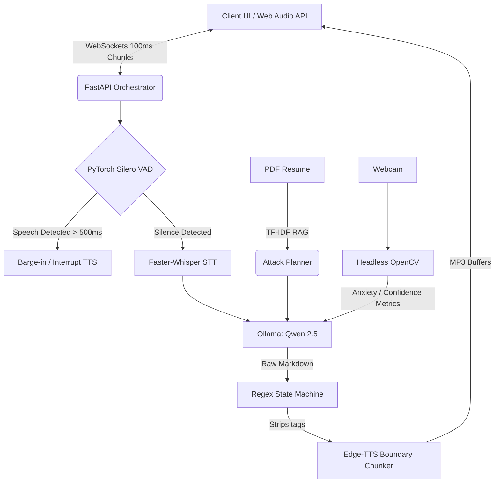

<p align="center">
  
  
  
  
  
</p>

<h1 align="center">🎙️ INTERVION</h1>
<h3 align="center">Real-Time AI Mock Interview Platform</h3>

<p align="center">
  <em>An ultra-low latency, full-duplex voice AI that conducts grueling Principal Engineer interviews. Features an asynchronous WebSocket orchestrator, PyTorch Voice Activity Detection (VAD) for instant barge-in, a RAG-based Omnipotent Attack Planner, and Headless OpenCV psychological profiling.</em>
</p>

---

## 🔥 What's New in INTERVION 2.0

INTERVION has been entirely rewritten from the ground up to achieve sub-500ms latency and human-like conversational fluidity.

- **Omnipotent Attack Planner:** During the 30-second initialization screen, the system uses TF-IDF to shred the candidate's PDF resume against a newly integrated `rubrics_bank.json` (containing deep FAANG engineering rubrics like Distributed Systems, Paxos Quorums, and C++ memory management). It formulates a hostile, targeted interrogation plan before the interview even starts.
- **Full-Duplex Async WebSockets:** Dropped the legacy Gradio UI and HTTP polling. The backend is now a 100% non-blocking `asyncio` FastAPI orchestrator processing 32-bit float audio arrays in real-time.
- **Hardware-Accelerated VAD & Barge-in:** Integrated PyTorch Silero VAD. If the candidate interrupts the AI, a 15-frame debounce counter (~500ms) validates the human speech, instantly halts the Web Audio API, and truncates the LLM context.
- **Qwen 2.5 Regex State Machine:** The backend now natively supports reasoning models. A custom regex pipeline consumes and discards `<think>` tokens silently, buffering natural text and dispatching to Edge-TTS only on exact sentence boundaries (`.`, `?`, `!`) for perfect vocal prosody.
- **Headless Psychological Profiling:** OpenCV runs in a background thread, computing Eye Aspect Ratios (EAR) and bounding box centroid Euclidean distances to feed real-time anxiety and fidgeting metrics to the LLM.
- **Event-Loop Safe Evaluation:** The massive 30-second final grading phase is decoupled via `loop.run_in_executor()`, guaranteeing the WebSocket connection never drops while the final report is generated.

---

## 🏗️ Architecture



---

## 🚀 Quick Start

### 1. Prerequisites
- **Python 3.11+**
- **Ollama** (with `qwen2.5` or `llama3` pulled locally)
- A microphone and webcam

### 2. Installation
```bash
# Clone the repository
git clone https://github.com/dhurv-gpt499/INTERVION.git
cd INTERVION

# Create a virtual environment and install dependencies
python -m venv venv
venv\Scripts\activate
pip install -r requirements.txt
```

### 3. Run the Servers
You need to have Ollama running in the background.

```bash
# Start Ollama (in a separate terminal)
ollama serve

# Start the INTERVION FastAPI Server
python server/main.py
```
Open `http://localhost:8000` in your browser. Upload your resume and click **Start Interview**.

---

## 🧠 Database Architecture

The system utilizes an intricate grading engine located in `database/`:
- `company_profiles.json`: Maps companies (e.g., Jane Street, Google) to specific engineering archetypes and primary focus arrays.
- `rubrics_bank.json`: Highly complex, Principal-level grading rubrics containing keywords, core questions, and required evaluation criteria.
- `question_bank.json`: An expansive repository of challenging technical problems.

---

## 🛡️ License

This project is licensed under the MIT License.

---

## 🛠️ Major Engineering Challenges & Solutions

### 1. AI Speaker Echo (Infinite Interruption Loops)
**The Problem:** Because the AI listens via a live WebSocket while speaking through the user's speakers, the microphone naturally picks up the AI's own Text-to-Speech output. The PyTorch VAD interpreted this as human speech, causing the AI to instantly interrupt itself in an infinite stuttering loop.
**The Solution:** Implemented a robust bidirectional state-machine synchronization. When the backend streams TTS to the client (state = ai_speaking), the server actively drops incoming VAD frames. To handle micro-echos, a 15-frame debounce counter (~500ms) was programmed into the VAD engine, requiring sustained human phoneme detection to trigger a true interrupt.

### 2. Qwen JSON Hallucination via Chain-of-Thought Abort
**The Problem:** The final report card must be deterministic JSON. However, local reasoning models (like Qwen 2.5) fail catastrophically when forced into strict JSON-mode constraints because bypassing their <think> phase aborts their chain-of-thought logic.
**The Solution:** Removed strict JSON schema constraints, allowing the model to "think" freely and output unstructured markdown. Engineered a custom Python regex state-machine to programmatically scrape the JSON object out of the raw response buffer post-generation, safely routing it through a pydantic schema validator.

### 3. Event Loop Starvation during LLM Inference
**The Problem:** When the user clicks "End Interview", the entire transcript is sent to Ollama for evaluation, blocking execution for nearly 30 seconds. Running this on the main syncio event loop stopped WebSocket Ping/Pongs, causing the browser to timeout and violently drop the connection.
**The Solution:** Offloaded all heavy, synchronous LLM HTTP requests to a background thread pool using loop.run_in_executor(). This decoupled the heavy compute from the event loop, allowing FastAPI to maintain WebSocket liveness heartbeats while generating the report safely in the background.

